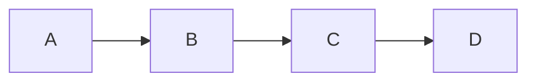

# Diagramas

Vamos testar um diagrama básico.

```mermaid

graph LR
   A-->B
   B-->C
   C-->D
```

Para ver diferentes exemplos de diagramas, visite:

- [Mermaid Cheat Sheet](https://jojozhuang.github.io/tutorial/mermaid-cheat-sheet/)

